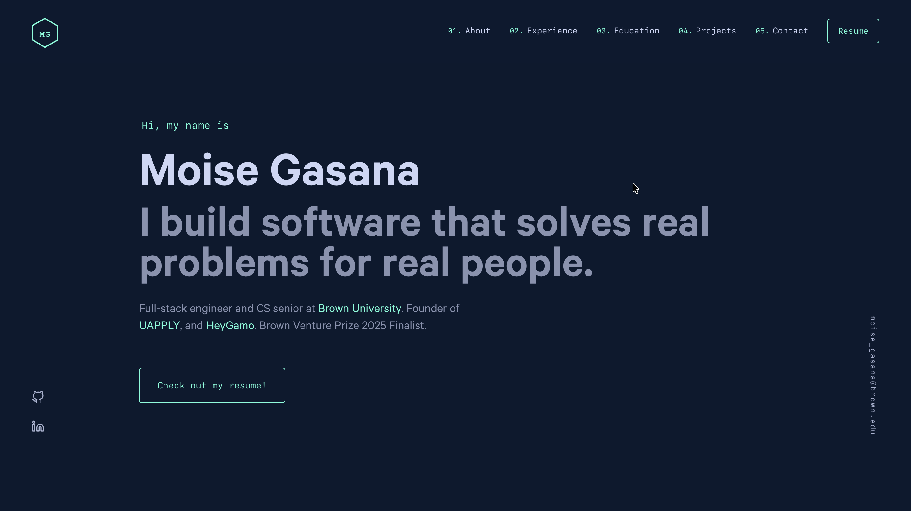

  

<h1 align="center">
  Moise Gasana
</h1>

  <a href="https://MG7CS.github.io/portfolio">MG7CS.github.io/portfolio</a>

  My personal website adapted from the fourth iteration of <a href="https://brittanychiang.com" target="_blank">brittanychiang.com</a> built with <a href="https://www.gatsbyjs.org/" target="_blank">Gatsby</a> and hosted with <a href="https://pages.github.com/" target="_blank">GitHub Pages</a>

  

Special thanks to <a href="https://brittanychiang.com" target="_blank">Brittany Chiang</a> for the original <a href="https://github.com/bchiang7/v4" target="_blank">template</a>.
